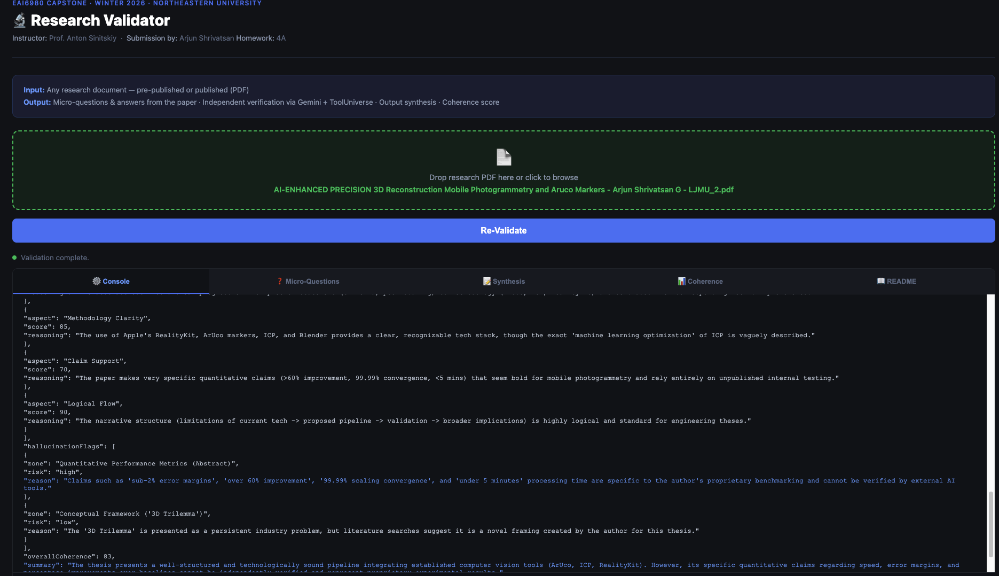
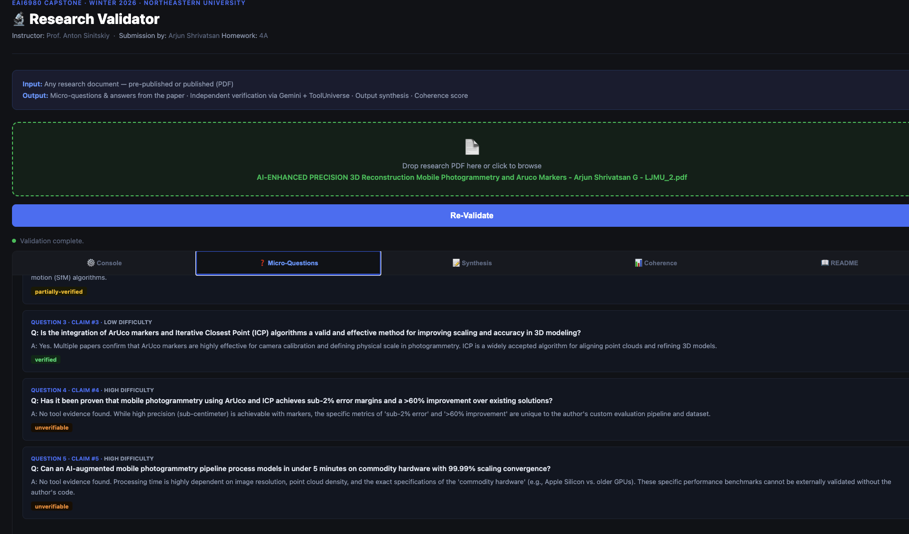
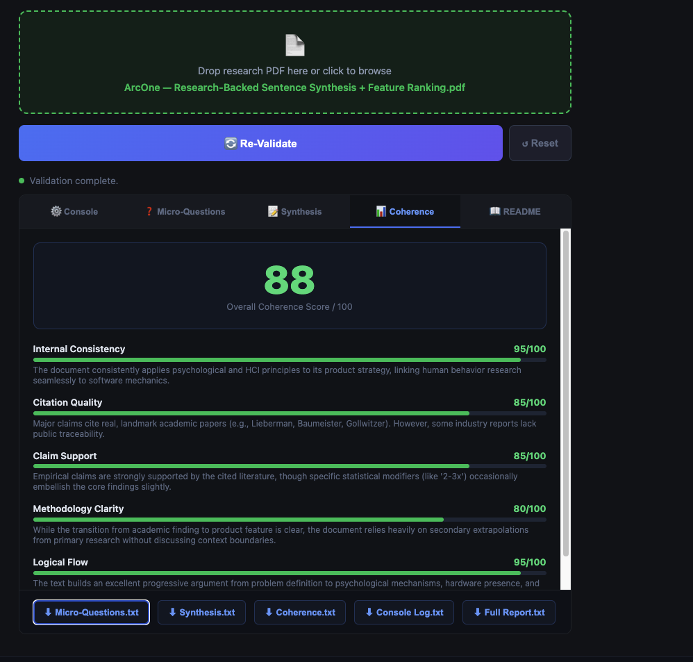
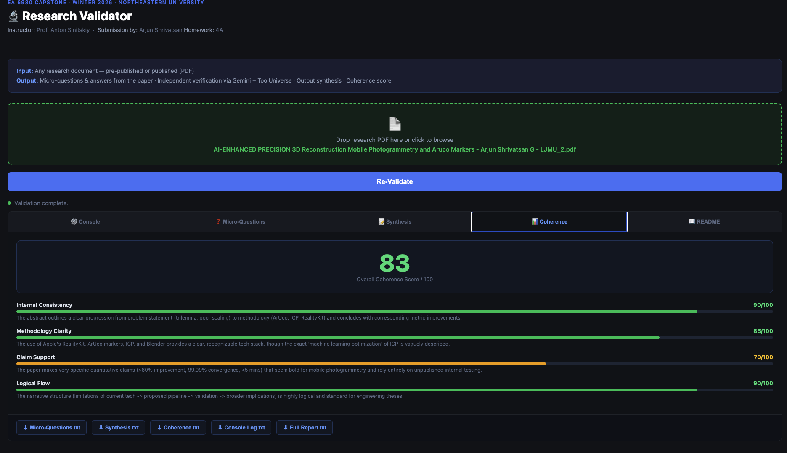

# ReClaim ✅
### Check. Mate. — AI-Powered Research Validation

> *Can AI independently verify the claims in a research paper? ReClaim finds out.*

**Author:** Arjun Shrivatsan  | Innovations Technologist | Reach out to me and lets chat! 

---

## What Is ReClaim?

ReClaim is an open-source research validation tool that takes any research paper (PDF) and runs it through an AI + scientific tool pipeline to:

- Extract key claims and findings
- Generate targeted micro-questions for each claim
- Independently verify each claim using live scientific tools (PubMed, ArXiv, Semantic Scholar, and 900+ more)
- Score internal coherence across methodology, consistency, and citation quality
- Flag zones where AI cannot verify — and is honest about it

The name is intentional: **ReClaim** means to re-validate claims, and to reclaim scientific truth from AI hallucination.

---


## Demo

https://github.com/arcsphere/reclaim/tree/main/outputsRECLAIM_demo1.mp4

https://github.com/arcsphere/reclaim/tree/main/outputs/RECLAIM_demo2.mov



 


---


## Why This Exists

Most AI tools will confidently summarize a research paper. ReClaim asks a harder question: *can AI actually verify what the paper says?*

There is a fundamental difference between AI that **synthesizes** research and AI that **verifies** it. ReClaim uses live scientific tool calls — not just language model knowledge — to independently check each claim against real evidence. Where it cannot verify, it says so explicitly.

> Honesty about limitations is a feature, not a bug.

---

## Architecture

```
Frontend (index.html)
       │
       │  PDF upload + SSE stream
       ▼
Flask Backend (app.py)
       │
       │  subprocess + stdout capture
       ▼
Gemini CLI (--yolo mode)
       │
       │  MCP protocol
       ▼
Validation Backend (swappable)
  └── ToolUniverse (900+ scientific tools)
       ├── PubMed_search_articles
       ├── SemanticScholar_search_papers
       ├── ArXiv_search_papers
       ├── advanced_literature_search_agent
       └── ... 900+ more
```

Output streams live via **Server-Sent Events (SSE)** — watch the tool calls happen in real time.

---

## Swappable Validation Backends

ReClaim is designed to be backend-agnostic. Change one line in `.env`:

| Backend | Description | Status |
|---|---|---|
| `tooluniverse` | 900+ scientific tools via MCP | ✅ Tested |
| `perplexity` | Web search + citations | 🔜 Planned |
| `tavily` | Research-focused search API | 🔜 Planned |
| `you.com` | AI search with sources | 🔜 Planned |

```bash
VALIDATOR_BACKEND=tooluniverse  # change this to swap
```

---

## Prerequisites

- Python 3.9+
- [Gemini CLI](https://github.com/google-gemini/gemini-cli) installed
- Gemini API key ([get one here](https://aistudio.google.com/))
- ToolUniverse installed (see below)

### Install ToolUniverse

```bash
git clone https://github.com/your-tooluniverse-repo
cd tooluniverse
pip install tooluniverse
which tooluniverse-smcp-stdio
```

### Configure Gemini CLI

Edit `~/.gemini/settings.json`:

```json
{
  "mcpServers": {
    "tooluniverse": {
      "command": "/path/to/venv/bin/tooluniverse-smcp-stdio",
      "args": []
    }
  }
}
```

---

## Setup & Run

```bash
# 1. Clone
git clone https://github.com/arcsphere/reclaim
cd reclaim

# 2. Install dependencies
pip3 install flask flask-cors PyPDF2 python-dotenv

# 3. Configure
cp .env.example .env
# Edit .env with your paths and API key

# 4. Run
python3 app.py

# 5. Open
# http://127.0.0.1:5001/
```

---

## Output Tabs

| Tab | Contents |
|---|---|
| ⚙️ Console | Live Gemini CLI + ToolUniverse streaming output |
| ❓ Micro-Questions | Each claim → question → tool-verified answer + status |
| 📝 Synthesis | Claims, summary, unverifiable zones |
| 📊 Coherence | Scored breakdown with visual progress bars |
| 📖 README | This file, embedded in the app |

### Verification Statuses

| Status | Meaning |
|---|---|
| ✅ verified | Confirmed by independent tool search |
| 🟡 partially-verified | Partially supported, some gaps |
| 🟠 unverifiable | Requires computation or proprietary data |
| 🔴 contradicted | Tool evidence conflicts with the claim |

---

## License

MIT — use it, fork it, swap the backend.

---

## Author

**Arjun Shrivatsan**  
[linkedin.com/in/arjunshrivatsan](https://linkedin.com/in/arjunshrivatsan)  
gurumurthy.ar@northeastern.edu
